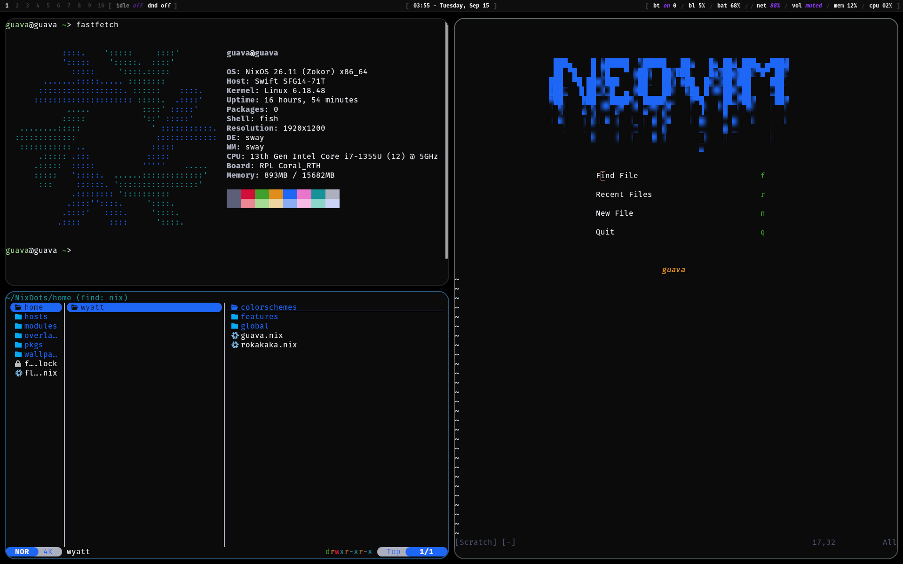

# NixDots

Personal, reproducible NixOS dotfiles for a SwayFX-based desktop. This flake keeps system configuration and Home Manager configuration together, with shared modules for common behavior and host-specific modules for hardware and workload differences.



## Goals

- Rebuild a complete desktop from a single, version-controlled Nix flake.
- Share most settings across machines while keeping hardware-specific configuration isolated.
- Keep the desktop fast, keyboard-driven, minimal, and visually consistent.
- Make tools and preferences declarative so changes are reviewable and repeatable.
- Provide a practical configuration to learn from and adapt, rather than a universal NixOS distribution.

## What is included

- Two NixOS configurations: `guava` (laptop) and `rokakaka` (desktop).
- Home Manager integrated as a NixOS module.
- SwayFX with Waybar, Wofi, Mako, Kitty, and clipboard/screenshot tooling.
- Fish, Yazi, and a custom Nixvim setup.
- A declarative color file, wallpaper, Firefox, and Wayland setup.
- Optional modules for Steam, Docker, PipeWire, OBS, Krita, Tailscale, and other host-specific software.
- Custom packages and overlays under `pkgs/` and `overlays/`.

## Repository layout

```text
flake.nix                  Flake inputs and NixOS host definitions
hosts/<hostname>/          Per-machine configuration and generated hardware config
hosts/common/              Shared system modules, users, and optional features
home/<user>/<hostname>.nix Per-user, per-machine Home Manager entry points
home/<user>/features/      Desktop, CLI, editor, game, and application modules
modules/home-manager/      Reusable Home Manager options
pkgs/                      Local packages
overlays/                  Package overlays
wallpapers/                Managed wallpapers
```

## Install

> These files contain machine-specific hardware, bootloader, display, username, and device settings. Do not switch directly to an existing host configuration on unrelated hardware. Fork the repository and create your own host first.

Install NixOS normally and make sure the target machine has internet access. Then clone the repository:

```bash
git clone https://github.com/guavaneck/NixDots.git ~/NixDots
cd ~/NixDots
```

Create a host configuration as described below, then build and activate it:

```bash
sudo nixos-rebuild switch --flake .#<hostname>
```

On subsequent updates, run the same command from the repository. To update flake inputs first:

```bash
nix flake update
sudo nixos-rebuild switch --flake .#<hostname>
```

The flake enables the `nix-command` and `flakes` experimental features after the first successful activation. If flakes are not enabled on the installer or current system yet, add `--extra-experimental-features 'nix-command flakes'` to the Nix commands.

## Create a user and host

The `home/wyatt/` directory is Wyatt's collection of shared Home Manager modules and per-host profiles. `wyatt` is not a system account: the current system accounts are `guava` and `rokakaka`.

To make this configuration your own, copy Wyatt's directory and use the copy as your personal configuration tree. For example, for a person named `alex` and a host/account named `mango`:

```bash
cp -r home/wyatt home/alex
```

Inside `home/alex/`, keep the shared modules you want and create `mango.nix` for the new host. This file selects the imports, username, packages, display, and other settings for that account:

```nix
{ pkgs, ... }: {
  imports = [
    ./global
    ./colorschemes/coding.nix
    ./features/desktop/swayfx
    ./features/desktop/common
    ./features/cli
    ./features/nixvim
    ./features/yazi.nix
    ./features/wallpaper.nix
  ];

  home.username = "mango";
}
```

You can also set up your own wallpaper here, screen resolution and refresh rate in this file optionally.

Home Manager does not create the underlying NixOS account. Copy `hosts/common/users/wyatt/` to `hosts/common/users/alex/`, then edit its `default.nix` so it declares `mango` and imports the matching profile from `home/alex/`:

```nix
{ config, pkgs, ... }: {
  users.mutableUsers = true;

  users.users.mango = {
    isNormalUser = true;
    shell = pkgs.fish;
    extraGroups = [ "wheel" "video" "audio" "docker" "networkmanager" ];
  };

  home-manager.users.mango =
    import ../../../../home/alex/${config.networking.hostName}.nix;
}
```

Create or copy the machine configuration at `hosts/mango/`. In `hosts/mango/default.nix`, set `networking.hostName = "mango";` and import the new user module:

```nix
imports = [
  ./hardware-configuration.nix
  ../common/global
  ../common/users/alex

  # Add the optional system modules you want here.
];
```

Finally, add the host to `flake.nix`. The name given after `nixosConfigurations` is the name used by `nixos-rebuild`, and `modules` must import the matching directory under `hosts/`:

```nix
nixosConfigurations.mango = nixpkgs.lib.nixosSystem {
  modules = [ ./hosts/mango ];
  specialArgs = { inherit inputs outputs; };
};
```
 
The complete path is therefore:

```text
flake.nix
  -> hosts/mango/default.nix
     -> hosts/common/users/alex/default.nix
        -> home/alex/mango.nix
```

Build it with:

```bash
sudo nixos-rebuild switch --flake .#mango
```

## Customization

### Installing packages

Packages used only by one account should normally go in that host's Home Manager profile. Add them to `home.packages` in `home/<user>/<hostname>.nix`:

```nix
{ pkgs, ... }: {
  home.packages = with pkgs; [
    blender
    obsidian
    prismlauncher
  ];
}
```

Packages needed by every user on a machine, during system startup, or by system services belong in the host configuration instead. Add them to `environment.systemPackages` in `hosts/<hostname>/default.nix`:

```nix
{ pkgs, ... }: {
  environment.systemPackages = with pkgs; [
    brightnessctl
    qemu
  ];
}
```

Put packages shared by several of your Home Manager profiles in one of the imported feature modules rather than repeating them in every host file. For example, CLI tools shared by Wyatt's profiles live in `home/wyatt/features/cli/default.nix`.

After adding a package, rebuild the host:

```bash
sudo nixos-rebuild switch --flake .#<hostname>
```

### Setting a wallpaper

Copy the image into `wallpapers/`, then expose it in `wallpapers/default.nix`:

```nix
{ ... }: {
  black = ./black-wallpaper.jpg;
  mountains = ./mountains.jpg;
}
```

Select it in `home/<user>/<hostname>.nix`:

```nix
{ pkgs, ... }: {
  wallpaper = pkgs.wallpapers.mountains;
}
```

The profile must import `./features/wallpaper.nix`. That module starts `swaybg` as a user service and displays the selected image using fill mode. A path can also be assigned directly, but adding it to `pkgs.wallpapers` keeps the wallpaper collection named and reusable across hosts.

### Changing fonts

Font defaults are defined in `home/<user>/features/desktop/common/font.nix`. Set both the font family name expected by applications and the Nix package that provides it:

```nix
{ pkgs, ... }: {
  fontProfiles = {
    enable = true;

    monospace = {
      name = "JetBrainsMono Nerd Font";
      package = pkgs.nerd-fonts.jetbrains-mono;
      size = 12;
    };

    regular = {
      name = "Inter";
      package = pkgs.inter;
      size = 12;
    };
  };
}
```

The font-profile module installs both packages and enables fontconfig. The monospace profile is consumed by Kitty and Waybar, while the regular profile is available to desktop applications. Use the font's exact family name; the package attribute and displayed family name are often different.

### Local packages and overlays

`pkgs/` contains packages maintained by this repository. Each package gets its own directory and is exported from `pkgs/default.nix`:

```nix
{ pkgs ? import <nixpkgs> {}, ... }: {
  koan = pkgs.callPackage ./koan {};
  my-tool = pkgs.callPackage ./my-tool {};
}
```

`overlays/default.nix` extends the normal Nixpkgs package set. Its `additions` overlay makes everything exported from `pkgs/default.nix` available as `pkgs.<name>` and also exposes the wallpaper collection as `pkgs.wallpapers`. The `modifications` overlay is the place to override or alter existing Nixpkgs packages.

Because the overlays are applied globally in `hosts/common/global/default.nix`, a local package can be installed like any other package:

```nix
home.packages = [ pkgs.koan ];
```

The `flake-inputs` overlay also exposes packages supplied by flake inputs through `pkgs.inputs.<input-name>`. Most users only need to edit `pkgs/` when packaging software that is not already available from Nixpkgs or another flake input.

## Existing hosts

| Host | Purpose | Notable differences |
| --- | --- | --- |
| `guava` | Laptop | systemd-boot, Intel graphics, laptop display, virtualization tools |
| `rokakaka` | Desktop | GRUB dual boot, AMD ROCm, OBS, Krita, games, and desktop-specific services |

## Notes

- `system.stateVersion` and `home.stateVersion` are intentionally pinned to `24.05`; do not change them just because the system is upgraded.
- Unfree packages are enabled.
- Review hardware UUIDs, output names, refresh rates, udev rules, and device-specific fixes before reusing a host configuration.
- The repository tracks `nixos-unstable`, so preview builds before switching and keep `flake.lock` committed for reproducibility.
